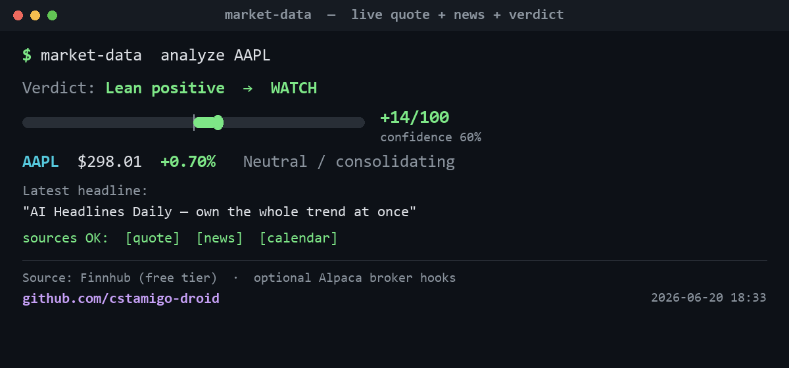

# market-data-mcp




**Real-time market data: quotes, news, earnings calendar, and a watchlist scanner for AI agents — backed by Finnhub.**

Gives any MCP client (Claude Desktop, Claude Code, agents) clean, uniform market data tools
that fail gracefully. A missing or premium-gated source returns *"no data"*, never a
fabricated value. Markdown output by default, JSON on demand.

---

## Tools

| Tool | What it does | Source | Free tier |
|------|--------------|--------|:---------:|
| `market_quote` | Real-time price, % change, high/low/open/prev-close | Finnhub `/quote` | Yes |
| `market_news` | Top 5 headlines — company-specific or general market | Finnhub `/company-news`, `/news` | Yes |
| `market_calendar` | Earnings calendar for the next N days (with EPS/revenue estimates) | Finnhub `/calendar/earnings` | Yes* |
| `market_scan` | Watchlist scanner: rank up to 25 tickers by absolute % change | Finnhub `/quote` x N | Yes |
| `market_analyze` | Composite: momentum score + news catalyst + earnings proximity | All of the above | Yes |
| `broker_positions` | Read open positions from Alpaca paper account | Alpaca Paper API | Optional** |

*Calendar tested live on 2026-06-14: accessible on Finnhub free tier.  
**broker_positions requires `ALPACA_API_KEY` + `ALPACA_SECRET_KEY` in `.env`. Degrades gracefully without them.

Every tool returns **Markdown** (human-readable, default) or **JSON** (`response_format="json"`) for programmatic use.

---

## Live demo output (2026-06-14)

```
market_quote AAPL:
  AAPL: $291.13  (-1.52%  -$4.50)  prev close $295.63

market_scan AAPL,MSFT,NVDA,TSLA:
  Scanned 4/4 symbols. Top mover: TSLA +1.82%

market_calendar days=7:
  20 earnings events in the next 7 days: ACN, KR, MEI ...

market_analyze AAPL:
  Signal: Lean negative  [......##|........] -30/100  confidence 60%
  AAPL: $291.13  -1.52%  → Lean negative [TRIM]
  Catalyst: Apple's iOS 27 surprise could change the AI narrative
```

---

## Quick start

```bash
git clone <your-repo-url> market-data-mcp
cd market-data-mcp
python -m venv .venv
.venv\Scripts\activate        # Windows
pip install -r requirements.txt

copy .env.example .env        # edit: add FINNHUB_API_KEY
python tests/test_smoke.py    # live test all 6 tools
```

Get a free Finnhub key at: https://finnhub.io/register

---

## Claude Desktop config

Add this to `claude_desktop_config.json`
(`%APPDATA%\Claude\` on Windows, `~/Library/Application Support/Claude/` on macOS),
then restart Claude Desktop:

```json
{
  "mcpServers": {
    "market-data-mcp": {
      "command": "python",
      "args": ["-m", "market_data_mcp"],
      "cwd": "C:/path/to/market-data-mcp"
    }
  }
}
```

Use the system Python path if you are not using a venv:

```json
{
  "mcpServers": {
    "market-data-mcp": {
      "command": "C:/Users/YourName/AppData/Local/Python/pythoncore-3.14-64/python.exe",
      "args": ["-m", "market_data_mcp"],
      "cwd": "C:/path/to/market-data-mcp",
      "env": { "PYTHONUTF8": "1" }
    }
  }
}
```

---

## Optional: Alpaca broker source

The `broker_positions` tool reads your Alpaca paper account. To enable it:

1. Go to https://app.alpaca.markets/ → Paper Trading → API Keys
2. Add to `.env`:
   ```
   ALPACA_API_KEY=your-key-here
   ALPACA_SECRET_KEY=your-secret-here
   ```
3. Restart the server.

Without these keys, `broker_positions` returns a graceful "keys not set" message.

---

## Why it's built this way

- **Uniform result contract.** Every source returns the same `Result` shape (source, ok, summary, data, score, confidence, error). An LLM can reason across all tools without parsing N formats.
- **Graceful degradation.** A source with no data, a premium-gated endpoint, or a missing key returns `Result.failed(...)` — never a fabricated value. Zero-price from Finnhub for unknown symbols is treated as "no data", not a quote.
- **Scored analysis.** The composite `market_analyze` tool emits a -100..+100 directional score with confidence, so an agent can triage without reading prose.
- **TTL cache.** Per-source in-process cache avoids hammering rate-limited APIs when an agent calls several tools in one turn (e.g. scan + analyze in sequence).

---

## Disclaimer

For research and educational use only. Data comes from Finnhub and Alpaca and
may be delayed or incomplete. Never use automated market data for financial decisions
without independent verification.

## License

MIT
